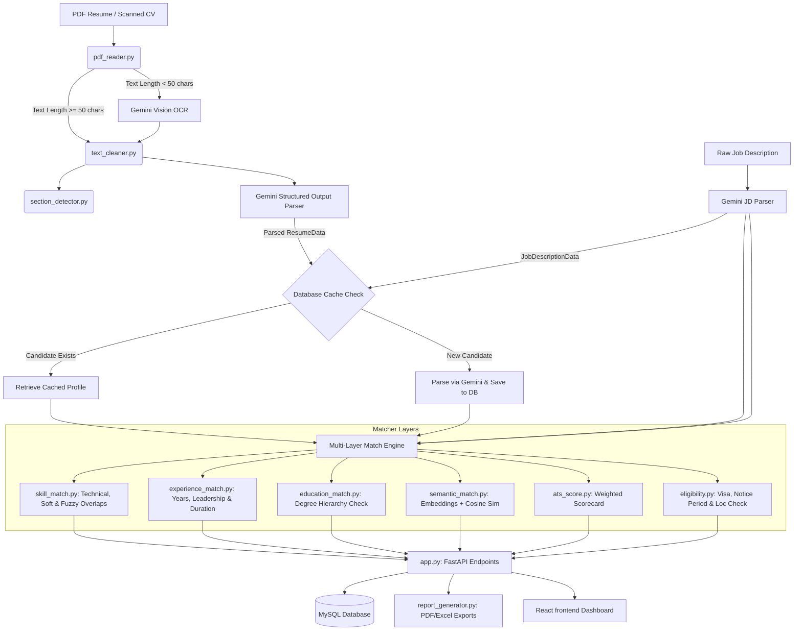

# 🚀 Resume Intelligence Platform

An enterprise-grade, production-ready AI recruiting copilot that ingests, parses, matches, and screens candidates using LLM structured outputs (Gemini API), custom text-extraction heuristics, vector embeddings, and localized semantic/algorithmic matching models.

---

## 📌 Table of Contents
1. [🌟 Key Features](#-key-features)
2. [📐 System Architecture & Data Flow](#-system-architecture--data-flow)
3. [📁 Codebase Structure](#-codebase-structure)
4. [🧠 Deep Dive: Matching & Analysis Engines](#-deep-dive-matching--analysis-engines)
5. [🗄️ Database Schema & Persistence](#%EF%B8%8F-database-schema--persistence)
6. [🔌 API Reference & Schema Specifications](#-api-reference--schema-specifications)
7. [💻 Front-End Recruiter Dashboard](#-front-end-recruiter-dashboard)
8. [⚙️ Setup & Deployment Guide](#%EF%B8%8F-setup--deployment-guide)
9. [🧪 Automated Testing Suite](#-automated-testing-suite)
10. [📈 Gemini API cost tracking & Token Control](#-gemini-api-cost-tracking--token-control)

---

## 🌟 Key Features

*   **Layout-Aware PDF Parser**: Analyzes bounding boxes spatially using PyMuPDF to extract text from multi-column CVs in correct reading order (avoiding column interleaving).
*   **Vision OCR Fallback**: Automatically triggers high-fidelity Gemini Vision OCR (`models/gemini-3.5-flash`) for scanned, non-selectable, or image-only PDFs.
*   **Structured Schema Extraction**: Utilizes Gemini Structured Outputs (using custom resolved JSON schemas mapped via Pydantic) to parse unstructured resume text into a highly structured data model.
*   **Dual Embedding Similarity**: Computes section-level cosine similarity using local SentenceTransformers (`all-MiniLM-L6-v2`) or remote Gemini API (`text-embedding-004`), with a robust TF-IDF fallback.
*   **Hybrid ATS Scorecard**: Computes a detailed score out of 100 based on weighted criteria (35% Skills, 30% Experience, 10% Projects, 10% Education, 5% Certifications, 5% Keywords, 5% Soft Skills).
*   **Hard Eligibility Constraints**: Filters candidates dynamically by Visa Requirements, Notice Period limits, Location/Remote preferences, and Education degree thresholds.
*   **Automated Quality & Style Audit**: Rates resume formatting, grammar, passive voice usage, weak verbs, missing quantifiable metrics, and prioritized improvement recommendations (High/Medium/Low).
*   **Recruiter Scale Utilities**:
    *   *Batch Ingestion*: Concurrently parses multiple resumes using `asyncio.gather`.
    *   *Candidate De-duplication*: Detects duplicate profiles using exact contact matches, RapidFuzz name ratio, and skill embedding cosine similarity.
    *   *K-Means Skill Clustering*: Clusters candidates into job cohorts using scikit-learn K-Means on skill vectors.
*   **Styled Report Exports**: Streams candidate scorecards directly to downloadable PDF layouts (via ReportLab) and Excel candidates compiler sheets (via OpenPyXL).

---

## 📐 System Architecture & Data Flow

The architecture decouples heavy LLM parsing operations from localized fast scoring calculations, ensuring optimal API usage, speed, and reliability.



---

## 📁 Codebase Structure

Below is the layout of the project, including links to primary files.

```
Resume Parser/
├── frontend/                     # Vite + React Client Dashboard
│   ├── src/
│   │   ├── components/
│   │   │   ├── Dashboard.jsx     # Candidate list, filters & aggregate metrics
│   │   │   ├── UploadPanel.jsx   # Ingestion panel for resumes and JDs
│   │   │   ├── ReportView.jsx    # Interactive interactive scorecard report
│   │   │   └── JobDescriptionList.jsx # Job descriptions portal
│   │   ├── App.jsx               # Main SPA routing & API coordinator
│   │   ├── App.css
│   │   ├── index.css             # System-wide CSS UI design rules
│   │   └── main.jsx
│   ├── package.json
│   └── vite.config.js
│
├── resume_ai/                    # Backend FastAPI API & Scoring Services
│   ├── ai/
│   │   ├── llm.py                # Gemini integration, JSON Schemas & cost computation
│   │   └── prompts.py            # AI System instructions (parsing & audits)
│   ├── api/
│   │   └── app.py                # FastAPI endpoints, batch concurrency & ranking routing
│   ├── database/
│   │   ├── db.py                 # MySQL SQLAlchemy config & auto DB creation
│   │   ├── models.py             # SQLAlchemy schemas for jobs, candidates & reports
│   │   └── crud.py               # DB queries for CRUD transactions
│   ├── matcher/
│   │   ├── ats_score.py          # Scorecard weighted compiler (35/30/10/10/5/5/5)
│   │   ├── education_match.py    # Education levels rank mapping
│   │   ├── eligibility.py        # Visa, notice, location hard filters
│   │   ├── embeddings.py         # Local SentenceTransformers / Gemini embedding router
│   │   ├── experience_match.py   # Job duration, gap detection & timeline merger
│   │   ├── semantic_match.py     # Cosine similarity calculations across sections
│   │   └── skill_match.py        # Technical/soft skills mapping & RapidFuzz similarity
│   ├── models/
│   │   ├── jd_schema.py          # Pydantic JD data model
│   │   ├── resume_schema.py      # Pydantic Candidate Resume data model
│   │   └── scoring_schema.py     # Pydantic Report & Card data models
│   ├── parser/
│   │   ├── pdf_reader.py         # Multi-column coordinate-aware PDF extractor
│   │   ├── resume_parser.py      # PDF Ingestion processing workflow (Text/OCR/Parsing)
│   │   ├── section_detector.py   # Token header categorizer
│   │   └── text_cleaner.py       # Raw text cleaning & sanitization
│   ├── utils/
│   │   ├── normalizer.py         # Skill alias standardization & date conversions
│   │   └── report_generator.py   # ReportLab PDF & OpenPyXL Excel rendering
│   └── tests/
│       └── test_platform.py      # Pytest suite for sanitization, scoring, rules & matcher
│
├── requirements.txt              # Backend PyPI packages
├── .env                          # Local credentials & API configurations
└── README.md                     # This documentation file
```

---

## 🧠 Deep Dive: Matching & Analysis Engines

### 1. ATS Scoring Model (ats_score.py)
The system calculates a final score out of 100 based on standard scorecard weights:
*   **Skills Score (35%)**: Evaluates matches of mandatory and preferred technical skills using rapidfuzz token ratios.
*   **Experience Score (30%)**: Matches candidate's relevant years of experience against requirements.
*   **Projects Similarity (10%)**: Uses vector embeddings to evaluate project content relevance to the JD.
*   **Education Score (10%)**: Degrees rank evaluation (Ph.D. = 5, Master's = 4, Bachelor's = 3, Associate = 2, High School = 1).
*   **Certifications (5%)**: Checks candidate's professional credentials against the job profile.
*   **Keywords Overlap (5%)**: Calculates density and occurrence frequency of crucial keywords in raw text.
*   **Soft Skills (5%)**: Evaluates soft skill attributes present in the resume.

### 2. Hard Eligibility Constraints (eligibility.py)
A candidate is flagged as `Eligible`, `Partially Eligible`, or `Not Eligible` according to:
*   **Visa/Sponsorship Restrictions**: If the job specifies citizen requirements, temporary visa statuses (H1B, OPT) trigger a failure.
*   **Notice Period Limitations**: Notice periods exceeding 90 days trigger a warning.
*   **Location Conflict**: Mismatch between the candidate's preferred location (onsite only) and the job's location.
*   **Experience Cap**: If the candidate has less than 50% of required years, they are rejected.
*   **Education Level**: If the candidate's degree is more than 1 rank below required, they fail eligibility.

### 3. Duplicate Detection & Clustering
*   **Duplicate Detector (`/duplicate_detect`)**: Compares candidates based on Email, Phone, and Fuzzy Name matching (RapidFuzz Token Sort Ratio >= 92) combined with a Skill Vector Cosine Similarity threshold of 90%.
*   **K-Means Clustering (`/cluster`)**: Converts candidate skill blocks into embeddings and groups candidates into $K$ distinct clusters using `sklearn.cluster.KMeans` to categorise applicants by skills profile.

---

## 🗄️ Database Schema & Persistence

Database engines are declared using SQLAlchemy models in [models.py](file:///c:/Users/user/Desktop/Resume%20Praser/resume_ai/database/models.py). The schema supports automatic MySQL initialization if the database is missing.

### 1. `jobs` Table
Stores parsed Job Description entities:
*   `id` (INT, Primary Key, Auto-increment)
*   `title` (VARCHAR(255))
*   `raw_text` (LONGTEXT)
*   `parsed_json` (LONGTEXT) - JSON Dump containing keywords, skills, experience specifications
*   `created_at` (DATETIME)

### 2. `candidates` Table
Stores parsed Candidate profile cards:
*   `id` (INT, Primary Key, Auto-increment)
*   `name` (VARCHAR(255))
*   `email` (VARCHAR(255), Indexed)
*   `phone` (VARCHAR(50))
*   `raw_resume_text` (LONGTEXT)
*   `parsed_json` (LONGTEXT) - Full structured ResumeData output
*   `created_at` (DATETIME)

### 3. `match_reports` Table
Stores candidate match evaluations and scores against jobs:
*   `id` (INT, Primary Key, Auto-increment)
*   `candidate_id` (INT, ForeignKey -> candidates)
*   `job_id` (INT, ForeignKey -> jobs)
*   `ats_score` (FLOAT)
*   `semantic_score` (FLOAT)
*   `skill_match` (FLOAT)
*   `experience_match` (FLOAT)
*   `education_match` (FLOAT)
*   `keyword_match` (FLOAT)
*   `eligibility` (VARCHAR(50))
*   `eligibility_reasons` (TEXT)
*   `full_report_json` (LONGTEXT) - Full `MatchReport` details
*   `created_at` (DATETIME)

---

## 🔌 API Reference & Schema Specifications

FastAPI exposes endpoints on port `8000`. Detailed specifications are found in [app.py](file:///c:/Users/user/Desktop/Resume%20Praser/resume_ai/api/app.py).

### 1. Ingest & Analyze Candidate
*   **URL**: `/analyze`
*   **Method**: `POST`
*   **Content-Type**: `multipart/form-data`
*   **Parameters**:
    *   `file` (PDF File Binary)
    *   `jd_text` (Form string)
*   **Description**: Extracts PDF text (layout aware), fetches profile cached data if candidate already exists in database, parsed JD text, evaluates matching matrices and quality audit, persists records and returns the final scorecard.
*   **Sample Response**:
    ```json
    {
      "id": 1,
      "candidate_id": 4,
      "job_id": 2,
      "ats_score": 84.5,
      "semantic_score": 78.9,
      "skill_match": 85.0,
      "experience_match": 90.0,
      "education_match": 100.0,
      "keyword_match": 60.0,
      "eligibility": "Eligible",
      "eligibility_reasons": ["Candidate meets all mandatory experience, education, skill, and location requirements."],
      "confidence": 0.95,
      "missing_skills": ["Kubernetes"],
      "resume_strengths": ["Strong overlap on tech stack", "Meets or exceeds minimum required relevant experience."],
      "resume_weaknesses": [],
      "recommendations": [
        {
          "recommendation": "Add quantifiable metric parameters on project descriptions.",
          "priority": "High",
          "section": "Experience"
        }
      ],
      "skill_gap_analysis": {
        "missing_skills": ["Kubernetes"],
        "weak_skills": ["Docker"],
        "strong_skills": ["Python", "React", "FastAPI"],
        "transferable_skills": [],
        "emerging_skills": []
      },
      "experience_analysis": {
        "total_experience_years": 6.2,
        "relevant_experience_years": 5.5,
        "leadership_experience_years": 1.5,
        "domain_experience_years": 4.0,
        "average_job_duration_months": 24.5,
        "employment_gaps": [],
        "frequent_job_changes": false
      },
      "keyword_analysis": {
        "ats_keywords": ["Python", "FastAPI", "Kubernetes", "AWS"],
        "missing_keywords": ["Kubernetes"],
        "keyword_density": {
          "python": 1.25,
          "fastapi": 0.78,
          "aws": 0.35
        },
        "important_phrases": ["fastapi backend development", "aws cloud hosting"],
        "industry_terms": ["API", "REST", "CI/CD"]
      },
      "quality_analysis": {
        "grammar_issues": [],
        "weak_action_verbs": ["helped"],
        "long_bullet_points": [],
        "passive_voice": ["Deployment was done by..."],
        "formatting_problems": [],
        "missing_contact_details": [],
        "missing_metrics": ["Led migration of services to AWS cloud."]
      },
      "llm_usage": {
        "total_prompt_tokens": 4521,
        "total_candidate_tokens": 1024,
        "total_tokens": 5545,
        "total_cost_usd": 0.000645,
        "calls": [...]
      }
    }
    ```

### 2. Rank Multiple Candidates
*   **URL**: `/rank`
*   **Method**: `POST`
*   **Content-Type**: `multipart/form-data`
*   **Parameters**:
    *   `files` (Array of PDF Binary files)
    *   `jd_text` (Form string)
*   **Description**: Ranks multiple PDF uploads against a job description, returning a sorted list based on ATS compatibility.

### 3. PDF Scorecard Generation
*   **URL**: `/report/pdf`
*   **Method**: `POST`
*   **Content-Type**: `application/json`
*   **Payload**: `MatchReport` object
*   **Description**: Generates and streams a custom designed candidate matching report in PDF format.

---

## 💻 Front-End Recruiter Dashboard

Built with Vite + React, the interface coordinates views into four distinct hubs:
1.  **Dashboard Hub ([Dashboard.jsx](file:///c:/Users/user/Desktop/Resume%20Praser/frontend/src/components/Dashboard.jsx))**: Central interface featuring global metrics (total candidates, eligible ratio, top matches) and filters by Job Specifications.
2.  **Job Specifications Hub ([JobDescriptionList.jsx](file:///c:/Users/user/Desktop/Resume%20Praser/frontend/src/components/JobDescriptionList.jsx))**: Lets recruiters add raw JDs, which are parsed and saved to the database.
3.  **Upload & Match Hub ([UploadPanel.jsx](file:///c:/Users/user/Desktop/Resume%20Praser/frontend/src/components/UploadPanel.jsx))**: Features a drag-and-drop ingestion interface supporting single uploads, batch ranking, and inline job selector configs.
4.  **Scorecard Hub ([ReportView.jsx](file:///c:/Users/user/Desktop/Resume%20Praser/frontend/src/components/ReportView.jsx))**: A premium visualization screen rendering overall ATS grades, categories (skills, education, project details), keyword density counts, quality audits, and direct PDF generation triggers.

---

## ⚙️ Setup & Deployment Guide

### 1. Prerequisite Installations
*   Python 3.10+
*   Node.js v18+
*   MySQL Server (with database schema set up)

### 2. Database Server Configurations
Set up a MySQL instance. Backend initialization handles the DB creation process automatically if the server is accessible.
Ensure database configs match details inside the `.env` settings:
```ini
MYSQL_HOST=127.0.0.1
MYSQL_PORT=3306
MYSQL_USER=your_user
MYSQL_PASSWORD=your_password
MYSQL_DATABASE=resume_intelligence
```

### 3. Backend Setup & Run
Create a virtual environment, install package dependencies, and start the FastAPI server:
```bash
# Navigate to project workspace root
python -m venv venv
venv\Scripts\activate

# Install PyPI dependencies
pip install -r requirements.txt

# Start the uvicorn API server
uvicorn resume_ai.api.app:app --host 127.0.0.1 --port 8000 --reload
```

### 4. Frontend Client Dashboard Setup
Start Vite development server from the frontend folder:
```bash
# Navigate to frontend folder
cd frontend
npm install

# Run the client app
npm run dev
```
Open [http://localhost:5173/](http://localhost:5173/) on your browser.

---

## 🧪 Automated Testing Suite

The platform has a unit-testing framework written in Pytest to check math calculations, date parsers, string cleaners, and rule-matching modules.

To execute tests:
```bash
# Run pytest in workspace root directory
pytest
```
*Tests are situated in [test_platform.py](file:///c:/Users/user/Desktop/Resume%20Praser/resume_ai/tests/test_platform.py) and test:*
*   Spatial text sanitizer and layout rules.
*   Skill mappings, company normalization, and date parser intervals.
*   Fuzzy skill matches and relevant experience merges.
*   Degree ranking checks and hard eligibility filters.

---

## 📈 Gemini API cost tracking & Token Control

To maintain budget predictability, the platform monitors token consumption and cost estimation on every model request.

1.  **Usage Monitoring**: Evaluates input and output token lengths via `response.usage_metadata` on every structured prompt call.
2.  **Dynamic Cost Model**: Automatically calculates model fees depending on the target configuration (Default model: `gemini-2.5-flash` at \$0.075/1M input and \$0.30/1M output, Fallback models automatically compute pro-rated metrics).
3.  **DB Logging**: Usage metrics are aggregated and saved directly inside database records, allowing developers to inspect total ingestion costs on the dashboard.
